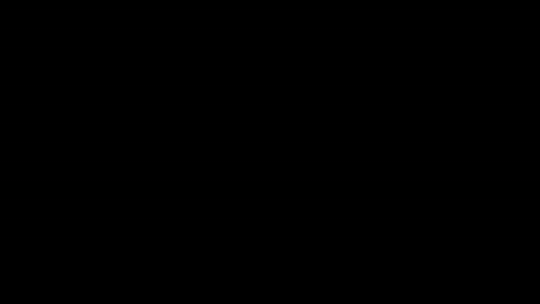

# Landauer-Phase-Lift Conductance Law


<!-- HERO_ANIMATION:BEGIN -->


_Hero animation: **Landauer phase-lift conductance law**. [Download high-resolution MP4](images/landauer_phase_lift.mp4)._
<!-- HERO_ANIMATION:END -->

**ID:** `eq-landauer-phase-lift-conductance-law`  
**Tier:** derived  
**Score:** 81  
**Units:** OK  
**Theory:** PASS-WITH-ASSUMPTIONS  

## Equation

$$
G=\frac{2e^2}{h}\sum_n T_n\cos^2\!\left(\frac{\theta_{R,n}}{2\pi_a}\right)
$$

## Description

Phase-memory extension of Landauer transport in which each transmission channel T_n is modulated by a bounded lifted-phase factor. The law preserves the standard mesoscopic conductance skeleton while adding a branch-consistent memory term that suppresses channels with unresolved or slip-prone phase history.

## Assumptions

- Transport can be decomposed into effective channels T_n
- Each channel admits a resolved phase theta_{R,n}
- The lifted-phase modulation is bounded and does not alter the Landauer prefactor
- pi_a sets the effective phase scale for memory-induced suppression

## Repository Structure

```
images/       # Visualizations, plots, diagrams
derivations/  # Step-by-step derivations and proofs
simulations/  # Computational models and code
data/         # Numerical data, experimental results
notes/        # Research notes and references
```

## Links

- [TopEquations Registry](https://rdm3dc.github.io/TopEquations/registry.html)
- [TopEquations Main Repo](https://github.com/RDM3DC/TopEquations)
- [Certificates](https://rdm3dc.github.io/TopEquations/certificates.html)

---
*Part of the [TopEquations](https://github.com/RDM3DC/TopEquations) project.*
